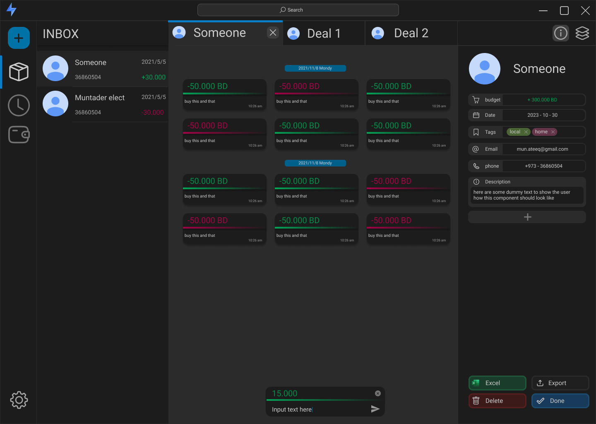

# Transaction Manager

<p align="center">
  <picture style="width: 500px">
    <source media="(prefers-color-scheme: light)" srcset="./resources/Banner-dark.png" />
    <source media="(prefers-color-scheme: dark)" srcset="./resources/Banner-light.png" />
    
  </picture>
</p>

Transaction Manager is a web application that allows users to create deals and manage transactions within those deals. It is built using Electron, Svelte, Vite, and Sass.



## Features

- Create and manage deals
- Add transactions to each deal
- View and edit deal details

## Upcoming Features

- Filter and search deals and transactions
- Export deals and transactions to CSV,Excel

## Technologies Used


- Electron: Electron is used to build cross-platform desktop applications using web technologies.
- Svelte: Svelte is a JavaScript framework for building user interfaces.
- Vite: Vite is a build tool that provides fast and efficient development server and build pipeline for modern web applications.
- Sass: Sass is a CSS preprocessor that helps in writing maintainable and reusable CSS.

## Installation

1. Clone the repository:

```
git clone https://github.com/your-username/transaction-manager.git
```

2. Install dependencies:

```
cd transaction-manager npm install
```

## Usage

1. Start the development server:

```
npm run dev
```

1. Access the application in your browser at `http://localhost:5173`.

## Contributing

Contributions are welcome! If you have any ideas, suggestions, or bug reports, please open an issue or submit a pull request.

## License

This project is licensed under the [MIT License](LICENSE).
